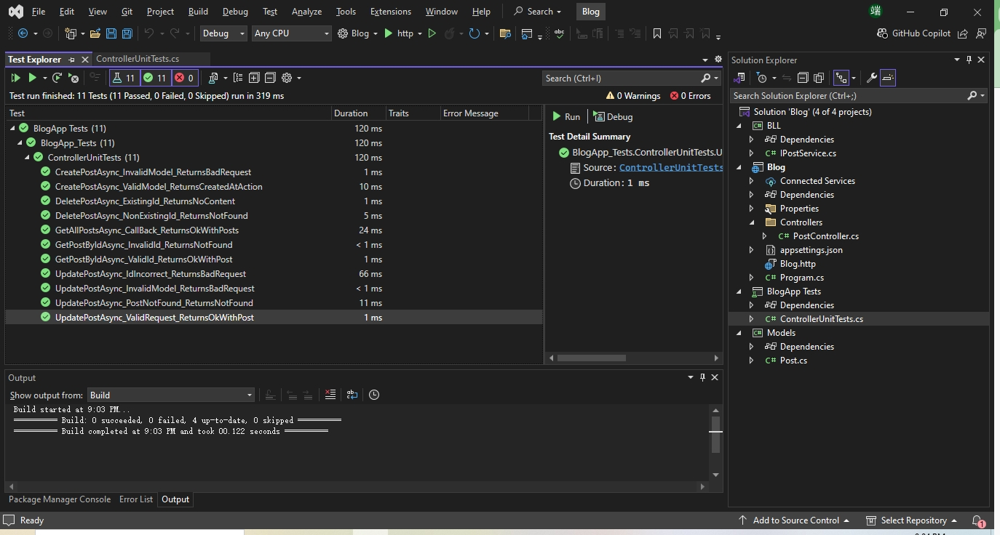

# Unit Test with moq for Blog Platform API

This project provides a comprehensive suite of **unit tests** for the Blog Platform API, focusing on testing the `PostController` in isolation using **Moq** and **xUnit**.

> The purpose of this project is to ensure that the Blog API's controller behaves as expected under various scenarios, including success, error, and edge cases ¡ª **without relying on actual service or database implementations**.

---

## What is Being Tested?

The `PostController` from the Blog Platform API, which exposes endpoints for:

- Getting all posts
- Getting a single post by ID
- Creating a post
- Updating a post
- Deleting a post

The controller depends on an abstraction: `IPostService`. In our tests, I mock this service to isolate the controller logic.

---

## Technologies Used

- .NET 8.0
- xUnit(Unit testing framework)
- Moq(Mocking framework for .NET)
- C#

---

## Test result screenshot

